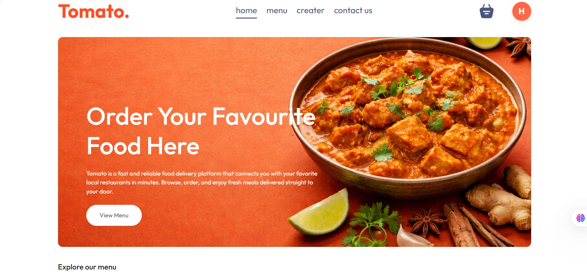
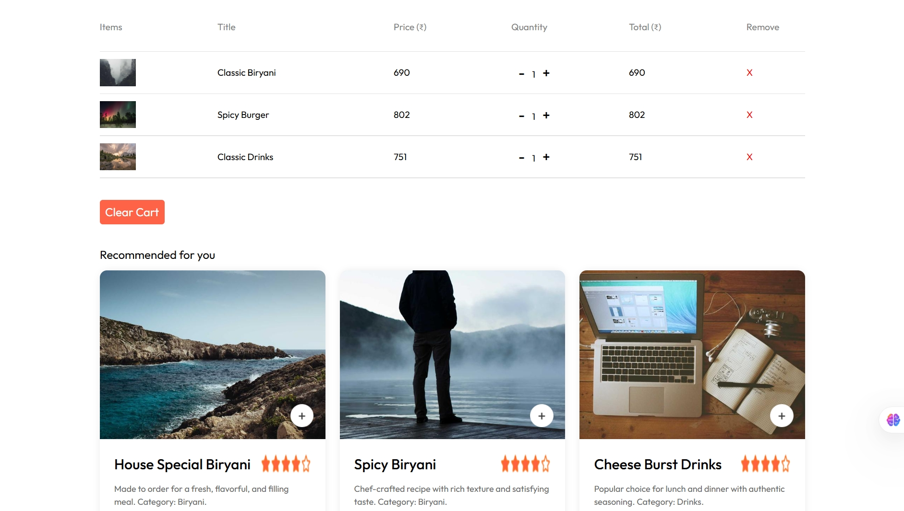
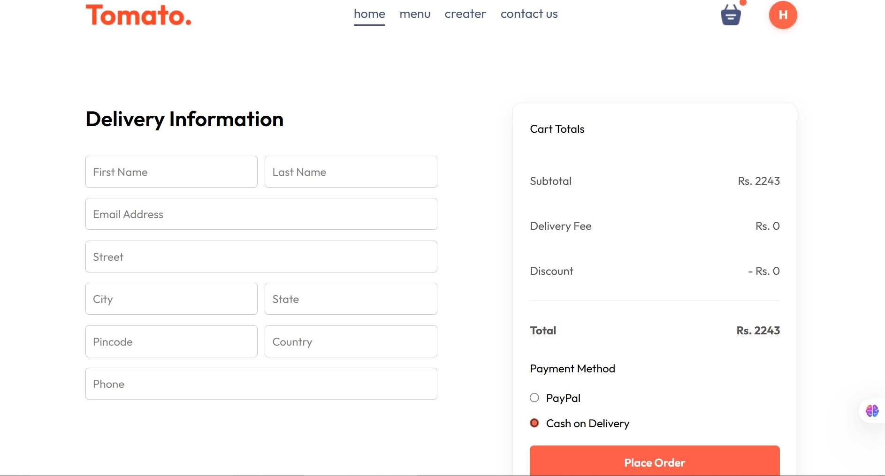
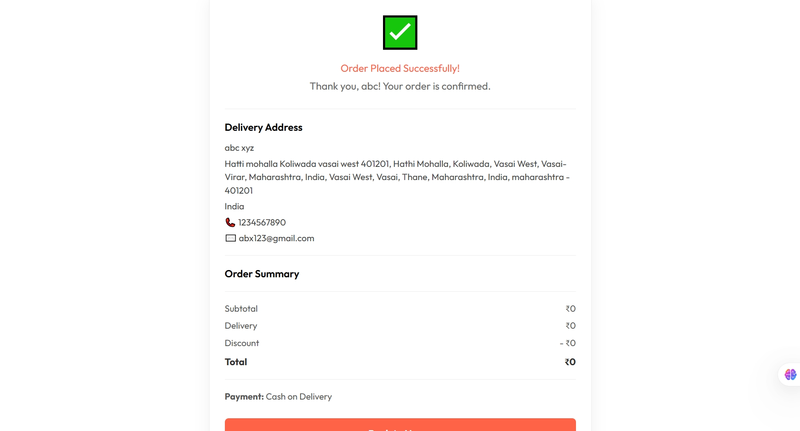

# Tomato 🍅 — Food Delivery Platform

A full-stack food delivery web application built with the MERN stack. Supports three user roles — Customer, Admin, and Delivery Partner — with real payment integration, order tracking, and a complete admin panel.

🌐 **Live Demo:** [food-orders-web.netlify.app](https://food-orders-web.netlify.app/)
🛠️ **Admin Panel:** [tomato-admin-sand.vercel.app](https://tomato-admin-sand.vercel.app/)

---

## Screenshots

| Home | Cart & Recommendations |
|------|----------------------|
|  |  |

| Checkout | Order Confirmation |
|----------|--------------------|
|  |  |

---

## Features

- **JWT Authentication** — Secure login/signup with token-based session management
- **Smart Recommendations** — Suggests products based on items in the user's cart
- **Search** — Real-time food item search across the menu
- **Order Tracking** — Users can track their order status live
- **Bill Summary with Graph** — Visual breakdown of order totals
- **Promo Codes** — Discount system with coupon code support
- **PayPal + Cash on Delivery** — Dual payment method support
- **Admin Panel** — Full CRUD for products, order management, and status updates
- **Three-Role System** — Separate flows for Customer, Admin, and Delivery Partner
- **Protected Routes** — Role-based access control on both frontend and backend

---

## Tech Stack

**Frontend**
- React.js, React Router, Context API
- Axios, react-hot-toast

**Backend**
- Node.js, Express.js
- MongoDB, Mongoose
- JWT, bcrypt

**Payment**
- PayPal REST API

**Deployment**
- Frontend → Netlify
- Admin Panel → Vercel
- Backend → Render

---

## Getting Started

### Prerequisites
- Node.js v18+
- MongoDB (local or Atlas)
- PayPal Developer account (for sandbox testing)

### Clone the repo

```bash
git clone https://github.com/zaid-shaikh17/Tomato-FrontEnd.git
cd tomato
```

### Backend setup

```bash
cd backend
npm install
```

Create a `.env` file in `/backend`:

```env
MONGODB_URI=your_mongodb_connection_string
JWT_SECRET=your_jwt_secret
PAYPAL_CLIENT_ID=your_paypal_client_id
PAYPAL_SECRET=your_paypal_secret
```

```bash
npm run server
```

### Frontend setup

```bash
cd frontend
npm install
npm run dev
```

### Admin setup

```bash
cd admin
npm install
npm run dev
```

---

## Folder Structure

```
tomato/
├── backend/        # Express API, routes, controllers, models
├── frontend/       # Customer-facing React app
└── admin/          # Admin panel React app
```

---

## Environment Variables

| Variable | Description |
|----------|-------------|
| `MONGODB_URI` | MongoDB connection string |
| `JWT_SECRET` | Secret key for JWT signing |
| `PAYPAL_CLIENT_ID` | PayPal sandbox client ID |
| `PAYPAL_SECRET` | PayPal sandbox secret |

---

## Author

**Shaikh Zaid** — [GitHub](https://github.com/zaid-shaikh17) · [LinkedIn](https://www.linkedin.com/in/shaikh-zaid-m8329981925/)

---

*Built as a final-year B.Sc. IT project. Open to fresher full-stack roles and internships.*
